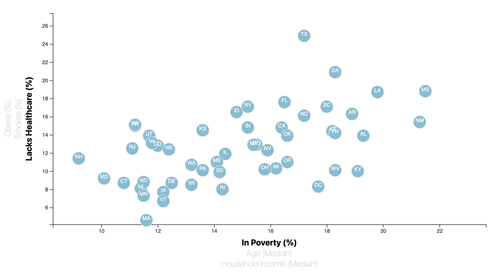
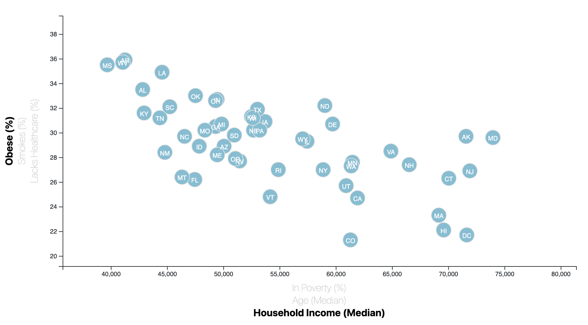

# D3-Challenge

Using `D3` techniques a scatter plot was created to visualize the 2014 Census data to plot the various data points. 

The code was written in the `app.js` file pulling in `data.csv` with the `d3.csv` function. 

Using event listeners on the x and y axis the graph is interactive to show the various points of data with a tooltip to display the data.

